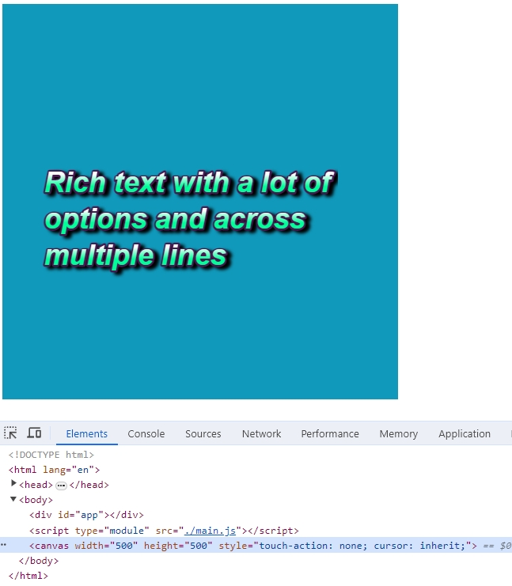

# 高阶API，自定义渲染器customRenderer

> 本文是 Vue3 源码实战专栏第 21 篇，实现自定义渲染器 custom renderer。

Vue3 中有一个高阶API，自定义渲染器。官方给出的定义是创建一个自定义渲染器。通过提供平台特定的节点创建以及更改 API，你可以在非 DOM 环境中也享受到 Vue 核心运行时的特性。

## 分析

自定义渲染器可以让应用在非 DOM 环境运行，但在之前的实现中都是基于 DOM 环境，例如使用虚拟节点创建真实节点时，都是通过 DOM 环境的API进行创建。

在 renderer.ts 中，`mountElement`方法里创建新节点使用的是`document.createElement`，属性设置使用`setAttribute`，节点添加使用`append`。自定义渲染器就意味着这部分固定的 DOM 环境API需要抽离出来作为 DOM 的固定接口。

将抽离出来的地方使用更为通用的渲染方法，当需要渲染成 DOM 时就使用 DOM 的接口，那当需要渲染成其他平台的例如 canvas，也可以传入 canvas 相关的 API 接口。

## 实现

renderer.ts 中将原有的所有逻辑都封装到一个方法中，再将上述抽离的方法作为参数传入。

```ts
export function createRenderer(options) {
  const { createElement, patchProp, insert } = options;

  function render(vnode, container) {
    patch(vnode, container, null);
  }

  // other code
  ...

  function mountElement(vnode, container, parentComponent) {
    const { type, children, shapeFlags } = vnode;
    let el = (vnode.el = createElement(type));

    if (shapeFlags & ShapeFlags.TEXT_CHILDREN) {
      el.textContent = children;
    } else if (shapeFlags & ShapeFlags.ARRAY_CHILDREN) {
      mountChildren(vnode, el, parentComponent);
    }

    const { props } = vnode;
    for (const key in props) {
      const value = props[key];

      patchProp(el, key, value);
    }

    insert(el, container);
  }

  // other code
  ...
}
```

并将`createRenderer`方法在 index.ts 导出，

```ts
export { createRenderer } from "./renderer";
```

src 下新建 runtime-dom，新建 index.ts 代码如下：

```ts
import { createRenderer } from "../runtime-core";

function createElement(type) {}
function patchProp(el, key, value) {}
function insert(el, container) {}

const renderer: any = createRenderer({
  createElement,
  patchProp,
  insert,
});
```

其中导入`createRenderer`会存在 ts 的报错，只需要修改 tsconfig.json，

```json
"moduleResolution": "node10" 
```

`createElement`，`patchProp`和`insert`方法中的逻辑，还是之前的，这里只是将 DOM 环境的 API 的相关实现抽离作为 DOM 类别的接口，这也为了保证原有的实现逻辑不变。

```ts
function createElement(type) {
  return document.createElement(type);
}

function patchProp(el, key, value) {
  const isOn = (key: string) => /^on[A-Z]/.test(key);
  if (isOn(key)) {
    const event = key.slice(2).toLowerCase();
    el.addEventListener(event, value);
  } else {
    el.setAttribute(key, value);
  }
}

function insert(el, container) {
  container.append(el);
}
```

因为在代码层面此时算是做了破坏性的变更，原本对外暴露的`render`方法被包裹起来了，那引用`render`方法的地方就会出问题。

createApp.ts 中`createApp`方法中使用了`render`。解决办法是可以`createApp`方法外层在封装一个方法，将`render`函数作为参数传入。

```ts
import { createVNode } from "./vnode";
export function createAppAPI(render) {
  return function createApp(rootComponent) {
    return {
      mount(rootContainer) {
        const vnode = createVNode(rootComponent);
        render(vnode, rootContainer);
      },
    };
  };
}
```

那原本对外暴露的`createApp`方法就失效了，index.ts 中导出`createApp`语句删除。

但是原本`createApp`方法对外暴露是需要直接提供给用户使用的，因此也需要再定义一个叫`createApp`方法对外暴露，可以借助在 renderer.ts 中`createRenderer`方法的返回值中实现`render`函数的透传。

```ts
import { createAppAPI } from "./createApp";
export function createRenderer(options) {
  const { createElement, patchProp, insert } = options;

  function render(vnode, container) {
    patch(vnode, container, null);
  }

  // other code
  ...

  return {
    createApp: createAppAPI(render),
  }
}
```

在 runtime-dom 的 index.ts 中导出`createApp`方法，而这里的方法单纯是封装一层用于对外暴露，

```ts
export function createApp(...args) {
  return renderer.createApp(...args);
}
```

现在 src 下有 runtime-core 和 runtime-dom，runtime-dom 的层级高于runtime-core，那对外暴露的入口就需要修改成 runtime-dom，在最外层的 index.ts 中导出，

```ts
export * from "./runtime-dom/index";
```

原本的 runtime-core 的导出方法，可以放在 runtime-dom 中，在 runtime-dom 的 index.ts 中，

```ts
export * from "../runtime-core";
```

## 验证

启动原本的测试项目，验证发现可以正常运行，说明这次变更也算是重构，是没有问题的。

那这样改造的自定义渲染器API，`createRenderer`的本质用途是，通过提供平台特定的节点创建以及更改 API，你可以在非 DOM 环境中也享受到 Vue 核心运行时的特性。
新建一个 customRenderer 项目进行验证是否可以在 canvas 平台运行。这里借助一个H5的游戏引擎实现 canvas 相关业务逻辑。

index.html 代码如下：

```html
<!DOCTYPE html>
<html lang="en">
  <head>
    <meta charset="UTF-8" />
    <meta name="viewport" content="width=device-width, initial-scale=1.0" />
    <title>custom renderer</title>
  </head>
  <script src="https://pixijs.download/release/pixi.js"></script>
  <body>
    <div id="app"></div>
    <script type="module" src="./main.js"></script>
  </body>
</html>
```

使用CDN引入 pixi.js，在浏览器控制台可以输出 PIXI，说明引入成功。

```js
main.js 代码如下：
import { createRenderer } from "../../lib/zwd-mini-vue.esm.js";
import { App } from "./App.js";

const app_PIXI = new PIXI.Application({
  width: 500,
  height: 500,
  background: "#1099bb",
});
document.body.appendChild(app_PIXI.view);

const renderer = createRenderer({
  createElement(type) {
    if (type === "text") {
      const style = new PIXI.TextStyle({
        fontFamily: "Arial",
        fontSize: 36,
        fontStyle: "italic",
        fontWeight: "bold",
        fill: ["#ffffff", "#00ff99"], // gradient
        stroke: "#4a1850",
        strokeThickness: 5,
        dropShadow: true,
        dropShadowColor: "#000000",
        dropShadowBlur: 4,
        dropShadowAngle: Math.PI / 6,
        dropShadowDistance: 6,
        wordWrap: true,
        wordWrapWidth: 440,
        lineJoin: "round",
      });

      const richText = new PIXI.Text(
        "Rich text with a lot of options and across multiple lines",
        style
      );
      return richText;
    }
  },

  patchProp(el, key, value) {
    el[key] = value;
  },

  insert(el, parent) {
    parent.addChild(el);
  },
});

renderer.createApp(App).mount(app_PIXI.stage);
```

以上代码中，`app_PIXI`创建的代码可以参考 pixi.js 官网，[查看这里](https://pixijs.com/examples/basic/container)

`new PIXI.Application`创建一个 canvas 画布，`app_PIXI.view`获取canvas 节点再添加到页面上，`createElement`方法是基于节点`type`类型创建相关的逻辑，实现逻辑都是基于 pixi.js，这里的`type`是**自定义**的，和 **App.js 中保持一致**。`insert`中 canvas 的添加 API 是`addChild`。

App.js代码如下：

```js
import { h } from "../../lib/zwd-mini-vue.esm.js";

export const App = {
  setup() {
    return {
      x: 50,
      y: 200,
    };
  },
  render() {
    return h("text", { x: this.x, y: this.y });
  },
};
```

页面效果如下：

