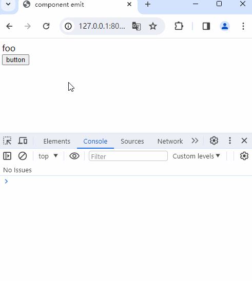

> 本文是 Vue3 源码实战专栏第 17 篇，实现组件 emit 功能。

你还在面试为了Vue源码而发愁吗？

## 前言

Vue 父子组件间传值，最基础也是最经典的实现就是父到子使用`props`传值，子到父使用`emit`触发，这样数据都是从父组件传输过来的，保证了数据的单一流向。

上篇文章《组件props传值大揭秘》实现了父组件到子组件的`props`功能，本篇文章来实现子组件到父组件到`emit`功能。

新建测试项目，App.js代码如下：

```js
import { h } from "../../lib/zwd-mini-vue.esm.js";
import { Foo } from "./Foo.js";

export const App = {
  render() {
    return h("div", {}, [
      h(Foo, {
        onAdd: () => {
          console.log("onAdd");
        }
      }),
    ]);
  },
  setup() {
    return {};
  },
};
```

Foo.js代码如下：

```js
import { h } from "../../lib/zwd-mini-vue.esm.js";

export const Foo = {
  setup(props, { emit }) {
    return {
      handleClick() {
        console.log("click");
        emit("add");
      },
    };
  },
  render() {
    const foo = h("div", {}, "foo");
    const btn = h(
      "button",
      {
        onClick: this.handleClick,
      },
      "button"
    );
    return h("div", {}, [foo, btn]);
  },
};
```

以上测试代码中，新建一个父组件App，它内部引用子组件Foo，子组件中按钮点击在控制台输出`click`，`setup`中第二个参数对象中`emit`方法可以对外抛出事件`add`。父组件在引用子组件时，调用`onAdd`方法可以触发子组件的事件，并在控制台输出`onAdd`。

简单总结一下，需要实现的功能点：

1. `setup`接收第 2 个参数对象，其中有`emit`方法
2. `emit`方法内自定义事件名，需要首字母大写再加上`on`，然后执行其函数
实现

因为`emit`参数是在`setup`方法中，实现的焦点就可以定位到`setup`函数调用，在 component.ts 中`setupStatefulComponent`方法里，`setup`方法执行时，给第 2 个参数对象。

```ts
function setupStatefulComponent(instance) {
  const Component = instance.type;

  instance.proxy = new Proxy({ _: instance }, PublicInstanceProxyHandlers);

  const { setup } = Component;
  if (setup) {
    const setupResult = setup(shallowReadonly(instance.props), {
      emit: instance.emit,
    });
    handleSetupResult(instance, setupResult);
  }
}
```
`emit`方法挂载在实例`instance`上，那在初始化时就需要给`emit`赋值，也就是需要从子组件中获取到`emit`内部的自定义方法名`add`。

```ts
export function createComponentInstance(vnode) {
  const component = {
    vnode,
    type: vnode.type,
    setupState: {},
    props: {},
    emit: () => {},
  };

  component.emit = emit.bind(null, vnode) as any;

  return component;
}
```

`emit`方法单独抽离出一个文件 componentEmit.ts。

这里需要注意一个点，在用户使用`emit`方法时，只需要传入一个自定义的事件名，但是在内部实现时，当拿到这个自定义事件名`event`，还需要父组件的`props`对象，才能根据这个`event`找到对应的`props`中的`key`，获取到相应的函数。

这就需要内部实现时默认传入`props`对象，这里的技巧是利用`bind`，第 1 个参数`this`不存在即为`null`，还可以传入一系列参数，则第 2 个参数传入虚拟节点`vnode`，即可从中解构出`props`。

componentEmit.ts 文件代码如下：
```ts
export function emit(instance, event) {
  const { props } = instance;
  
  const capitalize = (str: string) => {
    return str.charAt(0).toUpperCase() + str.slice(1);
  };
  const toHandlerKey = (str) => {
    return str ? `on${capitalize(str)}` : "";
  };

  const handlerName = toHandlerKey(event);
  const handler = props[handlerName];
  handler && handler();
}
```

以上代码，第 1 个参数`instance`就是通过`bind`绑定传入的参数`vnode`，第 2 个参数是用户自定义的事件名。按照测试项目的代码例子，这里传入的`event`就是`add`，只需要将`add`转换成`onAdd`，并获取到`onAdd`对应的函数，执行这个函数即可。
用户传入的自定义事件有`add`这样的命令方式，也可能存在`add-foo`这样的命令方法。

修改测试项目代码，Foo.js代码如下：
```js
export const Foo = {
  setup(props, { emit }) {
    return {
      handleClick() {
        console.log("click");
        emit("add");
        emit("add-foo");
      },
    };
  },
  render() {
    const foo = h("div", {}, "foo");
    const btn = h(
      "button",
      {
        onClick: this.handleClick,
      },
      "button"
    );
    return h("div", {}, [foo, btn]);
  },
};
```
App.js代码如下：
```js
export const App = {
  render() {
    return h("div", {}, [
      h(Foo, {
        onAdd: () => {
          console.log("onAdd");
        },
        onAddFoo: () => {
          console.log("onAddFoo");
        },
      }),
    ]);
  },
  setup() {
    return {};
  },
};
```

针对于不同的事件名规则，最终都需要转换成首字母大写的驼峰命名规则，再加上个`on`。那需要修改的地方只有`emit`方法内部，对于`event`的改造。
```ts
export function emit(instance, event) {
  const { props } = instance;

  const camelCase = (str) => {
    return str.replace(/-(\w)/g, (_, c: string) => {
      return c ? c.toUpperCase() : "";
    });
  };
  
  const capitalize = (str: string) => {
    return str.charAt(0).toUpperCase() + str.slice(1);
  };
  const toHandlerKey = (str) => {
    return str ? `on${capitalize(str)}` : "";
  };

  const handlerName = toHandlerKey(camelCase(event));
  const handler = props[handlerName];
  handler && handler();
}
```

以上代码中，`camelCase`方法就是针对`add-foo`这类命令规则的格式化，首先是改写成驼峰命名`addFoo`，然后调用之前的逻辑，改成首字母大写，再拼接`on`。

`camelCase`方法中采用正则表达式，获取到`add-foo`中的-f进行替换。这里回顾一下`replace`的使用，尤其是第 2 个参数是个函数的情况。

`replace`方法的第 2 个参数可以是一个函数。当第 2 个参数是函数时，`replace`方法会在匹配到的每个子串上调用该函数，并将匹配到的子串作为第一个参数传递给函数。可以根据需要在函数内部对匹配到的子串进行处理，并返回替换后的结果。

格式通常如下：
```js
function replacer(match, p1, p2, ..., offset, string) {
  // 处理匹配到的子串并返回替换后的结果
}
```

其中的参数说明如下：

* match：匹配到的子串。
* p1, p2, ...：如果正则表达式使用了分组捕获，这些参数表示从左到右的分组捕获结果。例如，如果正则表达式是 /(\w+)\s(\w+)/，并且应用于字符串 "Hello World"，那么 p1 将是 "Hello"，p2 将是 "World"。
* offset：匹配到的子串在原字符串中的偏移量。
* string：原始字符串。

函数可以返回用于替换的字符串。在函数中，可以根据需要对匹配到的子串进行处理，也可以使用其他逻辑来动态生成替换后的字符串。

以下是一个示例，将字符串中的数字加倍：
```js
const str = 'I have 3 apples and 5 oranges.';
const result = str.replace(/\d+/g, function(match) {
  return match * 2;
});

console.log(result);
// 输出：I have 6 apples and 10 oranges.
```

在上述示例代码中，正则表达式 `/(\d+)/g` 匹配到字符串中的数字，然后通过传递的函数将每个匹配到的数字乘以 2，最终得到替换后的字符串。

最后验证结果，

