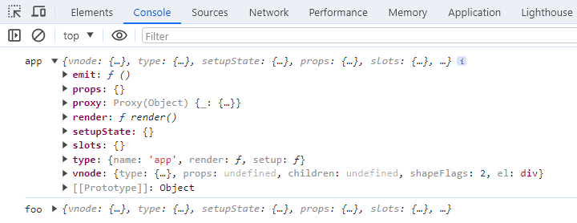

# 高级API getCurrentInstance

> [点击这里](https://mp.weixin.qq.com/mp/appmsgalbum?__biz=MzIzNDY1MDY5Ng==&action=getalbum&album_id=3177388392377237504&scene=173&subscene=227&sessionid=1705040547&enterid=1705040549&from_msgid=2247486605&from_itemidx=1&count=3&nolastread=1#wechat_redirect)进入专栏

在 Vue 3 中，`getCurrentInstance` 是一个全局 API，用于获取当前正在执行的组件实例。它返回一个组件实例对象，可以用于访问组件的属性、方法和生命周期钩子。

`getCurrentInstance` 是一个高级 API，一般用于在某些特殊场景下需要直接访问组件实例的情况。在大多数情况下，应该优先使用 Vue 3 提供的 Composition API 来管理组件状态和行为。

举个栗子，父组件App代码如下：

```vue
<template>
  <div>{{ app }}</div>
  <Foo></Foo>
</template>

<script setup>
import { getCurrentInstance, ref } from "vue";
import Foo from "./Foo.vue";
const app = ref("app");
const appInstance = getCurrentInstance();
console.log("app", appInstance);
</script>
```

子组件Foo代码如下：

```vue
<template>
  <div>Foo</div>
</template>

<script setup>
import { getCurrentInstance } from "vue";
const fooInstance = getCurrentInstance();
console.log("foo", fooInstance);
</script>
```

在浏览器控制台查看输出：


根据上面例子，在测试项目中新建App.js代码如下：

```js
import { h, getCurrentInstance } from "../../lib/zwd-mini-vue.esm.js";
import { Foo } from "./Foo.js";

export const App = {
  name: "app",
  render() {
    return h("div", {}, [h("p", {}, "app"), h(Foo)]);
  },
  setup() {
    const appInstance = getCurrentInstance();
    console.log("app", appInstance);
    return {};
  },
};
```

Foo.js 代码如下：

```js
import { h, getCurrentInstance } from "../../lib/zwd-mini-vue.esm.js";

export const Foo = {
  name: "foo",
  render() {
    return h("p", {}, "foo");
  },
  setup() {
    const fooInstance = getCurrentInstance();
    console.log("foo", fooInstance);
  },
};
```

因为 `getCurrentInstance` 这个方法是用于获取当前正在执行的组件实例，也就是将 component.ts 中的 `createComponentInstance` 方法的返回值，即返回组件实例。

因此这个方法可以放在 component.ts，再使用 1 个全局变量获取到当前组件实例。

```ts
let currentInstance = null;
export function getCurrentInstance() {
  return currentInstance;
}
```

`currentInstance`的赋值在`setup`执行期间，

```ts
function setupStatefulComponent(instance) {
  const Component = instance.type;
  instance.proxy = new Proxy({ _: instance }, PublicInstanceProxyHandlers);
  const { setup } = Component;
  if (setup) {
    setCurrentInstance(instance);
    const setupResult = setup(shallowReadonly(instance.props), {
      emit: instance.emit,
    });
    setCurrentInstance(null);
    handleSetupResult(instance, setupResult);
  }
}

function setCurrentInstance(instance) {
  currentInstance = instance;
}
```

最后在 index.ts 导出`getCurrentInstance`函数。

在浏览器控制台中查看输出：

