# 底层实现，组件slots插槽功能

> 本文是 Vue3 源码实战专栏第 18 篇，实现组件 slots 功能。
> 
> [点击这里](https://mp.weixin.qq.com/mp/appmsgalbum?__biz=MzIzNDY1MDY5Ng==&action=getalbum&album_id=3177388392377237504&scene=173&subscene=227&sessionid=1705040547&enterid=1705040549&from_msgid=2247486605&from_itemidx=1&count=3&nolastread=1#wechat_redirect)进入专栏

## 插槽

先来回顾插槽的使用，知其意才能究其根本。

插槽是用于在组件之间传递内容并实现组件的可复用性和灵活性。插槽允许开发者在组件的模板中定义占位符，然后在使用该组件时，通过插槽将内容插入到占位符中。其主要目的是解决组件的内容分发问题。它允许开发者灵活地定义组件的外部结构，同时保留内部组件的结构和逻辑。

插槽可以分为：

1. 默认插槽

默认插槽是最基本的插槽类型，用于在组件的模板中定义一个占位符。它可以通过 `<slot></slot>` 标签在组件的模板中定义，表示该位置将接受外部传入的内容。

举个栗子，父组件代码：

```js
<template>
  <div>App</div>
  <Foo>
    default slots
  </Foo>
</template>
<script setup>
import Foo from "./Foo.vue";
</script>
```

子组件代码：

```js
<template>
  <div>Foo</div>
  <div>
    <span>默认插槽</span>
    <slot></slot>
  </div>
</template>
```

结果：

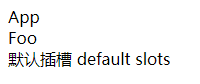

2. 具名插槽

具名插槽允许在组件中定义多个具名的插槽。通过在 `<slot>` 标签上添加 `name` 属性，可以为插槽命名。在使用组件时，可以使用 `<template v-slot:name></template>` 或简写的 `#name` 语法来将内容分发到具名插槽中。

举个栗子，父组件代码：

```js
<template>
  <div>App</div>
  <Foo>
    default slots
    <template #header> header slots </template>
  </Foo>
</template>
<script setup>
import Foo from "./Foo.vue";
</script>
```
子组件代码：

```js
<template>
  <div>Foo</div>
  <div>
    <span>默认插槽</span>
    <slot></slot>
  </div>
  <div>
    <span>具名插槽</span>
    <slot name="header"></slot>
  </div>
</template>
```

结果：

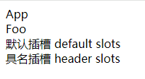

3. 作用域插槽

作用域插槽是一种特殊类型的插槽，允许组件在插槽中传递数据给插入的内容。它通过在插槽内容中使用 `<slot-scope>` 或简写的 `v-slot` 语法来定义。在使用组件时，可以在插槽标签上使用属性语法来接收传递的数据。

举个栗子，父组件代码：

```js
<template>
  <div>App</div>
  <Foo>
    default slots
    <template #header> header slots </template>
    <template v-slot:footer="{ message }">{{ message }}</template>
  </Foo>
</template>
<script setup>
import Foo from "./Foo.vue";
</script>
```

子组件代码：

```js
<template>
  <div>Foo</div>
  <div>
    <span>默认插槽</span>
    <slot></slot>
  </div>
  <div>
    <span>具名插槽</span>
    <slot name="header"></slot>
  </div>
  <div>
    <span>作用域插槽</span>
    <slot name="footer" message="scope slots"></slot>
  </div>
</template>
```

结果：

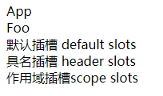

下面就来实现这三种插槽。

## 实现插槽

新建测试项目，App.js 代码如下：

```js
import { h } from "../../lib/zwd-mini-vue.esm.js";
import { Foo } from "./Foo.js";

export const App = {
  render() {
    const app = h("p", {}, "app");
    const foo = h(Foo, {}, h("p", {}, "123"));

    return h("div", {}, [app, foo]);
  },
  setup() {
    return {};
  },
};
```

上面代码中，定义了两个组件 `app` 和 `foo`，`app`组件是一个`p`标签渲染文字`app`， `foo`组件是引用子组件`Foo`，给`Foo`的`children`传入一个`p`标签渲染文字 123 。

Foo.js 代码如下：

```js
import { h } from "../../lib/zwd-mini-vue.esm.js";

export const Foo = {
  render() {
    const foo = h("p", {}, "foo");

    return h("div", {}, [foo]);
  },
  setup() {
    return {};
  },
};
```

上面代码中，子组件`Foo`中渲染了一个`foo`组件，现在想要实现的是引用`Foo`时传入的 123 能渲染出来。

在官方文章中给出了一个API `$slots` 可用于手写渲染函数中父组件传入的插槽对象。

### $slots

使用`$slots`完善上面的 Foo.js

```js
import { h } from "../../lib/zwd-mini-vue.esm.js";
export const Foo = {
  render() {
    const foo = h("p", {}, "foo");
    return h("div", {}, [foo, this.$slots]);
  },
  setup() {
    return {};
  },
};
```

需要实现 `$slots` 来实现将 123 这个`p`标签渲染到`foo`后面。

前面的文章[《Vue中this是怎么直接拿到数据的？》](https://mp.weixin.qq.com/s/LsBREizfVWF4_fvy88_-9A)中已经实现了`$el`，那`$slots`的实现也在相同的代码位置。

componentPublicInstance.ts 中添加 `$slots`

```ts
const publicPropertiesMap = {
  $el: (i) => i.vnode.el,
  $slots: (i) => i.slots,
};
```

这里定义的`slots`其实就是父组件传值的 123 `p`标签，也就是当前虚拟节点的`children`。在组件实例创建时初始化`slots`,

```ts
export function createComponentInstance(vnode) {
  const component = {
    vnode,
    type: vnode.type,
    setupState: {},
    props: {},
    slots: {},
    emit: () => {},
  };
  component.emit = emit.bind(null, vnode) as any;
  return component;
}

export function setupComponent(instance) {
  initProps(instance, instance.vnode.props);
  initSlots(instance, instance.vnode.children);
  setupStatefulComponent(instance);
}
```

初始化`slots`的方法可以单独抽离，新建文件componentSlots.ts，将虚拟节点上的`children`挂载到实例上。

```js
export function initSlots(instance, children) {
  instance.slots = children
}
```

验证结果：

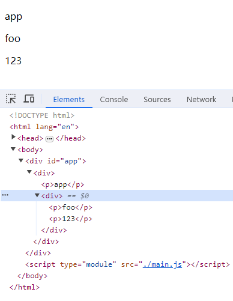

### renderSlot

那如果引用 Foo 组件时传入的`children`是个数组会怎么样？

修改App.js代码如下：

```js
import { h } from "../../lib/zwd-mini-vue.esm.js";
import { Foo } from "./Foo.js";

export const App = {
  render() {
    const app = h("p", {}, "app");
    const foo = h(
      Foo,
      {},
      [h("p", {}, "123"), h("p", {}, "456")]
    );
    return h("div", {}, [app, foo]);
  },
  setup() {
    return {};
  },
};
```

再次验证发现页面上无法正常显示，但是控制台输出的`this.$slots`显示是一个数组。这是因为渲染节点的`children`只能是单个的`vnode`，对于数组可以用h函数进行包裹，将数组内部修改成`vnode`。

将Foo.js代码修改如下：

```js
import { h } from "../../lib/zwd-mini-vue.esm.js";
export const Foo = {
  render() {
    const foo = h("p", {}, "foo");
    console.log(this.$slots);
    return h("div", {}, [
      foo,
      h("div", {}, this.$slots)
    ]);
  },
  setup() {
    return {};
  },
};
```

但是这样实现需要用户多操作一步，显然是不优雅的，因此可以将这里的实现抽离出成 API 对外提供。

在 Vue 3 Template Explorer 中可以查看一下`template`对应的`render`是什么样的，这里官方提供了`renderSlot`方法。

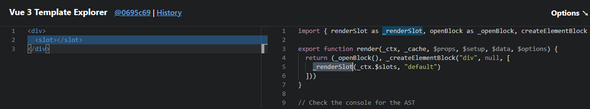

新建文件夹 helps，新建文件 renderSlot.ts

```ts
import { createVNode } from "../vnode";

export function renderSlot(slots) {
  if (slot) {
    return createVNode("div", {}, slot);
  }
}
```

将renderSlot在index.ts中导出，方便用户使用。修改Foo.js代码如下：

```js
import { h, renderSlot } from "../../lib/zwd-mini-vue.esm.js";
export const Foo = {
  render() {
    const foo = h("p", {}, "foo");
    console.log(this.$slots);
    return h("div", {}, [
      foo,
      renderSlot(this.$slots)
    ]);
  },
  setup() {
    return {};
  },
};
```

验证结果：

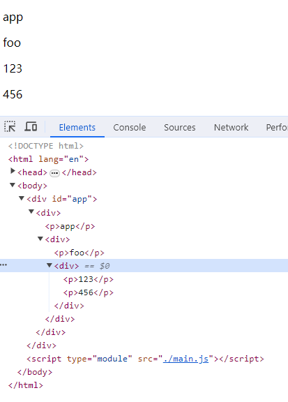

这样传入的`children`是一个数组的情况，就成功实现了。那此时再验证如果`children`是单值的话，发现页面上无法正常显示，这是因为`initSlots`中对`children`类型判断不完善导致的。


```js
export function initSlots(instance, children) {
  instance.slots = Array.isArray(children) ? children : [children];
}
```

再次验证两种`children`的情况，都是可以正常显示的。

### 具名插槽

修改测试项目App.js代码如下：

```js
import { h } from "../../lib/zwd-mini-vue.esm.js";
import { Foo } from "./Foo.js";

export const App = {
  render() {
    const app = h("p", {}, "app");
    const foo = h(
      Foo,
      {},
      {
        header: h("p", {}, "123"),
        footer: h("p", {}, "456"),
      }
    );

    return h("div", {}, [app, foo]);
  },
  setup() {
    return {};
  },
};
```
Foo.js代码如下:

```js
import { h, renderSlots } from "../../lib/zwd-mini-vue.esm.js";

export const Foo = {
  render() {
    const foo = h("p", {}, "foo");

    console.log(this.$slots);
    return h("div", {}, [
      renderSlots(this.$slots, "header"),
      foo,
      renderSlots(this.$slots, "footer"),
    ]);
  },
  setup() {
    return {};
  },
};
```

以上的测试代码，通过对象`key`指定渲染的插槽和渲染的位置，这和`template`写法的底层逻辑实现是一样的。

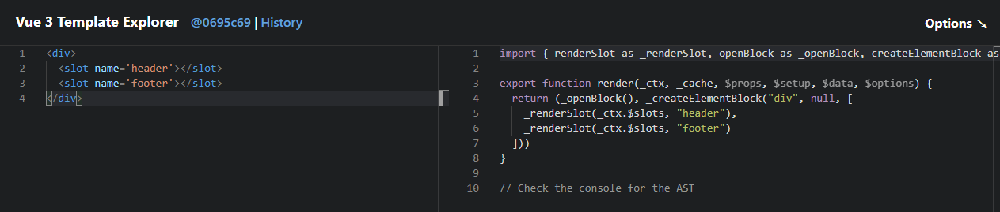

那现在Foo子组件的`children`是对象格式，具体的修改如下。

`initSlots`方法中，

```js
export function initSlots(instance, children) {
 const {slots} = instance
  for (const key in children) {
    const value = children[key];
    instance.slots[key] = Array.isArray(value) ? value : [value];
  }
}
```
`renderSlots`方法中

```js
import { createVNode } from "../vnode";
export function renderSlots(slots, name, props) {
  const slot = slots[name];
  if (slot) {
    return createVNode("div", {}, slot);
  }
}
```

浏览器页面显示结果如下：

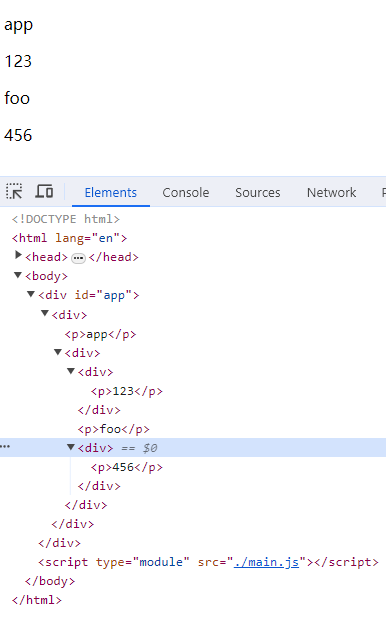

回顾上面实现的代码，`initSlots`函数可以重构一下，让代码更具语义化。

```js
export function initSlots(instance, children) {
  normalizeObjectSlots(children, instance.slots);
}

function normalizeObjectSlots(children, slots) {
  for (const key in children) {
    const value = children[key];
    slots[key] = normalizeSlotsValue(value);
  }
}

function normalizeSlotsValue(value) {
  return Array.isArray(value) ? value : [value];
}
```

### 作用域插槽

修改测试项目，App.js代码如下：

```js
import { h } from "../../lib/zwd-mini-vue.esm.js";
import { Foo } from "./Foo.js";

export const App = {
  render() {
    const app = h("p", {}, "app");
    const foo = h(
      Foo,
      {},
      {
        header: ({ age }) => h("p", {}, "123" + age),
        footer: () => h("p", {}, "456"),
      }
    );

    return h("div", {}, [app, foo]);
  },
  setup() {
    return {};
  },
};
```

上面代码中，`header`插槽中输出`age`参数。Foo.js代码如下：

```js
import { h, renderSlots } from "../../lib/zwd-mini-vue.esm.js";

export const Foo = {
  render() {
    const foo = h("p", {}, "foo");

    console.log(this.$slots);
    const age = 18;
    return h("div", {}, [
      renderSlots(this.$slots, "header", {
        age,
      }),
      foo,
      renderSlots(this.$slots, "footer"),
    ]);
  },
  setup() {
    return {};
  },
};
```

子组件`Foo`中在插槽中传入数据`age`，`renderSlots`方法添加第 3 个参数对象，父组件传入的`this.$slots`是个对象，且`key`对应的`value`值是函数类型，这样才能从函数参数中获取到`age`。

修改`renderSlots`方法，兼容函数类型格式，

```js
import { createVNode } from "../vnode";

export function renderSlots(slots, name, props) {
  const slot = slots[name];
  if (slot) {
    if (typeof slot === "function") {
      return createVNode("div", {}, slot(props));
    }
  }
}
```

那相应的，在 componentSlots.ts 中`slots`初始化时修改成函数处理，在`shapeFlags`中添加`slots`格式类型，来判断当前节点是否为插槽。

```js
import { ShapeFlags } from "../shared/shapeFlags";

export function initSlots(instance, children) {
  const { vnode } = instance;
  if (vnode.shapeFlags & ShapeFlags.SLOTS_CHILDREN) {
    normalizeObjectSlots(children, instance.slots);
  }
}

function normalizeObjectSlots(children, slots) {
  for (const key in children) {
    const value = children[key];
    slots[key] = (props) => normalizeSlotsValue(value(props));
  }
}

function normalizeSlotsValue(value) {
  return Array.isArray(value) ? value : [value];
}
```

`ShapeFlags`枚举类型中添加`SLOTS_CHILDREN`

```js
export const enum ShapeFlags {
  ELEMENT = 1,
  STATEFUL_COMPONENT = 1 << 1,
  TEXT_CHILDREN = 1 << 2,
  ARRAY_CHILDREN = 1 << 3,
  SLOTS_CHILDREN = 1 << 4,
}
```

在创建虚拟节点时候，对于节点类型的判断也需要添加`slots`类型的判断，

```js
export function createVNode(type, props?, children?) {
  const vnode = {
    type,
    props,
    children,
    shapeFlags: getShapeFlags(type),
    el: null,
  };

  if (typeof children === "string") {
    vnode.shapeFlags = vnode.shapeFlags | ShapeFlags.TEXT_CHILDREN;
  } else if (Array.isArray(children)) {
    vnode.shapeFlags = vnode.shapeFlags | ShapeFlags.ARRAY_CHILDREN;
  }

  if (vnode.shapeFlags && ShapeFlags.STATEFUL_COMPONENT) {
    if (typeof children === "object") {
      vnode.shapeFlags = vnode.shapeFlags | ShapeFlags.SLOTS_CHILDREN;
    }
  }

  return vnode;
}
```

浏览器中验证，`header`插槽位置成功渲染了`age`数值。

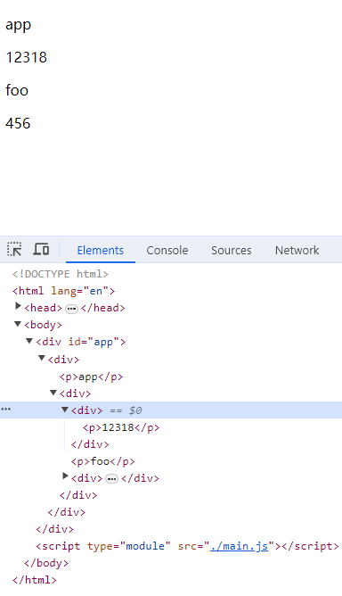

## Fragment

从上面的 dom 结构截图中，可以发现一个问题，每一个`p`标签都由一个`div`包裹着，这样`div`明显是多余的，这是因为创建虚拟节点时不接受数组格式，只能是一个单独的`element`，所以`renderSlots`方法中全是用div创建一个虚拟节点包裹着所有插槽。

解决方案是在创建时有一个专门用来渲染数组的方法的，也就是`Fragment`的实现。

修改`renderSlots`方法，在创建虚拟节点时就不借用`div`，使用`Fragment`这个`type`来标记。

```js
import { createVNode } from "../vnode";

export function renderSlots(slots, name, props) {
  const slot = slots[name];
  if (slot) {
    if (typeof slot === "function") {
      return createVNode("Fragment", {}, slot(props));
    }
  }
}
```

在 renderer.ts 中`patch`方法，添加对于`Fragment`的处理，

```js
function patch(vnode, container) {
  const { type, shapeFlags } = vnode;

  switch (type) {
    case "Fragment":
      processFragment(vnode, container);
      break;

    default:
      if (shapeFlags & ShapeFlags.ELEMENT) {
        processElement(vnode, container);
      } else if (shapeFlags & ShapeFlags.STATEFUL_COMPONENT) {
        processComponent(vnode, container);
      }
      break;
  }
}

function processFragment(vnode, container) {
  mountChildren(vnode, container);
}
```

上面代码中，使用`switch`来分类判断`type`，原有逻辑不动放入`default`。`processFragment`方法是处理`Fragment`类型，此时的`children`是数组格式，复用原本的`mountChildren`方法即可。

浏览器中验证：

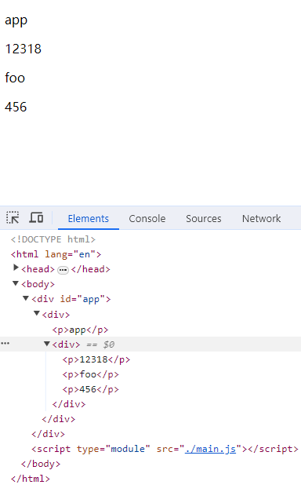

### 优化

在`patch`方法和`renderSlots`方法中，`Fragment`类型都是直接字符串表示，可以用一个`Symbol`唯一值来表示。

在 vnode.ts 中导出`Symbol`类型的`Fragment`，

```js
export const Fragment = Symbol("Fragment");
```
相应的在在`patch`方法和`renderSlots`方法中引用该`Fragment`。

## 纯文本节点

和`Fragment`实现类似，这里就顺道实现一下。

修改测试项目 App.js 代码如下：

```js
import { h, createTextVNode } from "../../lib/zwd-mini-vue.esm.js";
import { Foo } from "./Foo.js";

export const App = {
  render() {
    const app = h("p", {}, "app");
    const foo = h(
      Foo,
      {},
      {
        header: ({ age }) => [
          h("p", {}, "123" + age),
          createTextVNode("Hello World"),
        ],
        footer: () => h("p", {}, "456"),
      }
    );

    return h("div", {}, [app, foo]);
  },
  setup() {
    return {};
  },
};
```

以上代码中，想要实现的就是插入纯文本节点。`header`插槽中`p`标签后插入一个纯文本节点`Hello World`。

来看一下 template 写法下编译的结果，在开发过程中可能更多的是采用左侧这种 template 写法或者 jsx，但是右侧是更底层的实现，无论是 template 还是 jsx 都是依据这些底层实现的。


创建纯文本节点需要用到`createTextVNode`这个方法。

vnode.ts 中定义 Text 节点类型，仍然是`Symbol`类型，保证唯一性。

```js
export const Text = Symbol("Text");

export function createTextVNode(text: string) {
  return createVNode(Text, {}, text);
}
```

导出`createTextVNode`方法，该方法只接受一个字符串参数`text`，实现逻辑还是创建一个虚拟节点，只是它的`type`类型是我们定义的 Text。那在`patch`渲染时再单独判断一下 Text 类型的情况。

```js
function patch(vnode, container) {
  const { type, shapeFlags } = vnode;

  switch (type) {
    case Fragment:
      processFragment(vnode, container);
      break;
    case Text:
      processText(vnode, container);
      break;

    default:
      if (shapeFlags & ShapeFlags.ELEMENT) {
        processElement(vnode, container);
      } else if (shapeFlags & ShapeFlags.STATEFUL_COMPONENT) {
        processComponent(vnode, container);
      }

      break;
  }
}

function processText(vnode, container) {
  const { children } = vnode;
  let textNode = (vnode.el = document.createTextNode(children));
  container.append(textNode);
}
```

最后，在 index.ts 中导出`createTextVNode`方法供用户使用。

浏览器中验证：

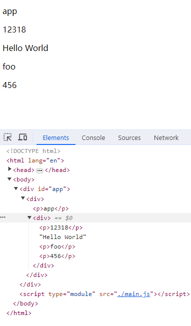
