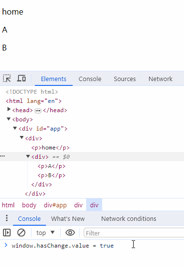

# 建议收藏！Vue双端对比diff算法，一次说清楚

> [点击这里](https://mp.weixin.qq.com/mp/appmsgalbum?__biz=MzIzNDY1MDY5Ng==&action=getalbum&album_id=3177388392377237504&scene=173&subscene=227&sessionid=1705040547&enterid=1705040549&from_msgid=2247486605&from_itemidx=1&count=3&nolastread=1#wechat_redirect)进入专栏

## 更新element流程搭建

新建测试项目 update，App.js 代码如下：

```js
import { h, ref } from "../../lib/zwd-mini-vue.esm.js";

export const App = {
  name: "App",
  setup() {
    let count = ref(0);
    const onClick = () => {
      count.value++;
    };
    return {
      count,
      onClick,
    };
  },
  render() {
    return h("div", {}, [
      h("div", {}, `count: ${this.count}`),
      h(
        "button",
        {
          onClick: this.onClick,
        },
        "click"
      ),
    ]);
  },
};
```

上面代码中，渲染了两个组件，`count`组件中从`setup`获取`count`的响应值，按钮组件有一个点击事件，点击会触发`count`变量自增。

这里引用了`ref`方法，首先解决的就是`ref`方法的导出。

### 导出ref

reactivity 下新建 index.ts 用于文件导出的接口。

```ts
export { ref } from "./ref";
```

再在根目录下的 index.ts 导出 reactivity

```ts
export * from "./runtime-dom/index";
export * from "./reactivity";
```

实时编译执行`yarn build --watch`， 在浏览器中查看效果，


发现`count`显示的是`ref`对象，期待的是在渲染中使用`ref`对象是可以直接获取其`value`值。

在 ref.ts 中`proxyRefs`方法用于自动解析`ref`对象，可以直接获取`.value`的数据。

在 index.ts 中导出`proxyRefs`方法，

```ts
export { ref, proxyRefs } from "./ref";
```

渲染时获取到`setup`返回值的处理逻辑是在 component.ts 下的`handleSetupResult`方法里，对`setup`返回值`setupResult`处理即可，

```ts
function handleSetupResult(instance, setupResult) {
  if (typeof setupResult === "object") {
    instance.setupState = proxyRefs(setupResult);
  }
  finishComponentSetup(instance);
}
```

在浏览器中查看效果，`count`值如期显示。

### 流程改造

在渲染中访问`count`变量，会触发它的`get`操作，进行依赖收集，在点击操作时候更新`count`值，就需要触发依赖。

在 render.ts 中 `setupRenderEffect`方法，生成虚拟节点树进行`patch`逻辑处理转换成真实节点挂载到容器里。此时更新渲染中用到的响应式数据，只需要将原有逻辑用`effect`包裹，就可以再次触发依赖执行。

这里回顾一下`effect`。`effect`直接翻译为作用，意思是使其发生作用，这个使其的其就是我们传入的函数，所以`effect`的作用就是让我们传入的函数发生作用，也就是执行这个函数。

```ts
function setupRenderEffect(instance, initialVnode, container) {
  effect(() => {
    const { proxy } = instance;
    const subTree = (instance.subTree = instance.render.call(proxy));
    patch(subTree, container, instance);
    initialVnode.el = subTree.el;
  });
}
```

当初次执行，生成的虚拟节点转换成真实节点会挂载到容器里，如果更新之后再次触发，就会再次生成新的虚拟节点转换成真实节点并再次挂载到容器里，会出现如下这样的情况：


这明显是不对的，更新操作是需要定位到需要更新的数据节点处进行替换，也就是这儿例子中的`count`所在`div`，当点击一次之后，只需要将原本的`count: 0`转变成`count: 1`即可，`button`这样的其他的元素保持不动。

在组件实例对象`instance`上定义一个布尔值变量`isMounted`，用来判断初始化阶段还是更新阶段。在更新操作阶段，会存在两份新老虚拟节点，老的虚拟节点树的数据可以在初始化时候保存一份在`instance`中，方便更新阶段获取。

```ts
function setupRenderEffect(instance, initialVnode, container) {
  effect(() => {
    if (!instance.isMounted) {
      console.log("init");
      const { proxy } = instance;
      const subTree = (instance.subTree = instance.render.call(proxy));
      patch(null, subTree, container, instance);
      initialVnode.el = subTree.el;
      instance.isMounted = true;
    } else {
      console.log("update");
      const { proxy } = instance;
      const subTree = instance.render.call(proxy);
      const prevSubTree = instance.subTree;
      patch(prevSubTree, subTree, container, instance);
    }
  });
}
```

上面代码可以看出，`patch`方法接收了新老两份虚拟节点树，那整体涉及到`patch`的方法都需要修改一下参数，完整代码如下：

```ts
export function createRenderer(options) {
  const { createElement, patchProp, insert } = options;

  function render(n2, container) {
    patch(null, n2, container, null);
  }

  // n1: 老的
  // n2: 新的
  function patch(n1, n2, container, parentComponent) {
    const { type, shapeFlags } = n2;

    switch (type) {
      case Fragment:
        processFragment(n1, n2, container, parentComponent);
        break;
      case Text:
        processText(n1, n2, container);
        break;

      default:
        if (shapeFlags & ShapeFlags.ELEMENT) {
          processElement(n1, n2, container, parentComponent);
        } else if (shapeFlags & ShapeFlags.STATEFUL_COMPONENT) {
          processComponent(n1, n2, container, parentComponent);
        }

        break;
    }
  }

  function processFragment(n1, n2, container, parentComponent) {
    mountChildren(n2, container, parentComponent);
  }

  function processElement(n1, n2, container, parentComponent) {
    if (!n1) {
      mountElement(n2, container, parentComponent);
    } else {
      patchElement(n1, n2, container);
    }
  }

  function patchElement(n1, n2, container) {
    console.log("patchElement");

    console.log("n1", n1);
    console.log("n2", n2);
  }

  function processText(n1, n2, container) {
    const { children } = n2;
    let textNode = (n2.el = document.createTextNode(children));
    container.append(textNode);
  }

  function mountElement(vnode, container, parentComponent) {
    const { type, children, shapeFlags } = vnode;
    let el = (vnode.el = createElement(type));

    if (shapeFlags & ShapeFlags.TEXT_CHILDREN) {
      el.textContent = children;
    } else if (shapeFlags & ShapeFlags.ARRAY_CHILDREN) {
      mountChildren(vnode, el, parentComponent);
    }

    const { props } = vnode;
    for (const key in props) {
      const value = props[key];
      patchProp(el, key, value);
    }

    insert(el, container);
  }

  function mountChildren(vnode, el, parentComponent) {
    vnode.children.forEach((n2) => {
      patch(null, n2, el, parentComponent);
    });
  }

  function processComponent(n1, n2, container, parentComponent) {
    mountComponent(n2, container, parentComponent);
  }

  function mountComponent(initialVnode, container, parentComponent) {
    const instance = createComponentInstance(initialVnode, parentComponent);
    setupComponent(instance);
    setupRenderEffect(instance, initialVnode, container);
  }

  function setupRenderEffect(instance, initialVnode, container) {
    effect(() => {
      if (!instance.isMounted) {
        console.log("init");
        const { proxy } = instance;
        const subTree = (instance.subTree = instance.render.call(proxy));
        patch(null, subTree, container, instance);
        initialVnode.el = subTree.el;
        instance.isMounted = true;
      } else {
        console.log("update");
        const { proxy } = instance;
        const subTree = instance.render.call(proxy);
        const prevSubTree = instance.subTree;
        patch(prevSubTree, subTree, container, instance);
      }
    });
  }

  return {
    createApp: createAppAPI(render),
  };
}
```

其中，还需要修改的是`patchElement`方法，因为更新的是`element`，那关注点也是放在`element`处理逻辑上，也就是`processElement`方法里。当没有`n1`参数时，就说明此时是初始化操作阶段，还是走原有逻辑挂载`element`，否则就是更新逻辑。`patchElement`方法中就需要处理对比更新的逻辑。

组件实例上新定义的`isMounted`和`subTree`，初始化时都要提前定义好，

```ts
export function createComponentInstance(vnode, parent) {
  const component = {
    vnode,
    type: vnode.type,
    setupState: {},
    props: {},
    slots: {},
    provides: parent ? parent.provides : {},
    parent,
    isMounted: false,
    subTree: {},
    emit: () => {},
  };
  component.emit = emit.bind(null, vnode) as any;
  return component;
}
```

在浏览器中，验证结果：


## 更新props

修改测试项目 update，App.js 代码如下：

```js
import { h, ref } from "../../lib/zwd-mini-vue.esm.js";

export const App = {
  name: "App",
  setup() {
    let count = ref(0);
    const onClick = () => {
      count.value++;
    };

    let obj = ref({
      foo: "foo",
      bar: "bar",
    });
    const changeObj1 = () => {
      obj.value.foo = "new-foo";
    };
    const changeObj2 = () => {
      obj.value.foo = undefined;
    };
    const changeObj3 = () => {
      obj.value = {
        foo: "foo",
      };
    };

    return {
      count,
      onClick,

      obj,
      changeObj1,
      changeObj2,
      changeObj3,
    };
  },
  render() {
    return h("div", { ...this.obj }, [
      h("div", {}, `count: ${this.count}`),
      h("button", { onClick: this.onClick }, "click"),
      h("button", { onClick: this.changeObj1 }, "修改foo"),
      h("button", { onClick: this.changeObj2 }, "foo为undefined"),
      h("button", { onClick: this.changeObj3 }, "没有bar"),
    ]);
  },
};
```

以上代码，新增了 3 个按钮，用于验证 `props` 更新的 3 个场景，分别是：

1. 修改响应式对象`obj`中`foo`的值，预期在`props`中`foo`的值修改
2. 设置`foo`为`undefined`或`null`，预期`props`中移除`foo`
3. 设置`obj`对象，不存在`bar`，预期`props`中移除`bar`

将`obj`对象绑定在最外层`div`的属性中，便于验证。

页面效果如下：


### 修改foo

更新`props`，则需要新老两份`props`，

```ts
function patchElement(n1, n2, container) {
  const oldProps = n1.props || {};
  const newProps = n2.props || {};
  patchProps(oldProps, newProps);
}
patchProps方法中，对比新老props。修改foo为新的值，则遍历新的props,
function patchProps(el, oldProps, newProps) {
  if (oldProps !== newProps) {
    for (const key in newProps) {
      const prevProp = oldProps[key];
      const nextProp = newProps[key];

      if (prevProp !== nextProp) {
        hostPatchProp(el, key, prevProp, nextProp);
      }
    }
}
```

以上代码，新老`props`不同时才需要对比。遍历新的`props`中，找到每一项新老的`prop`，也只有新老的`prop`不同时才需要更新，这里更新的操作调用原本封装好的`hostPatchProp`方法，但是该方法接收的参数中需要一个`el`，又少一个`prevProp`参数。

**改造`patchProp`**，`el`的来源，在`n1`上存在`el`，但是在更新之后，现在的`n2`就会变成`n1`，可是`n2`上并没有`el`，就需要在此时把 `n1`上的`el`提前保存一份到`n2`上，这样就保证了`el`数据传递下去。

```ts
function patchElement(n1, n2, container) {
  const oldProps = n1.props || {};
  const newProps = n2.props || {};
  const el = (n2.el = n1.el);
  patchProps(el, oldProps, newProps);
}

function patchProps(el, oldProps, newProps) {
  if (oldProps !== newProps) {
    for (const key in newProps) {
      const prevProp = oldProps[key];
      const nextProp = newProps[key];
      if (prevProp !== nextProp) {
        hostPatchProp(el, key, prevProp, nextProp);
      }
    }
  }
}
```

`hostPatchProp`方法，也就是`patchProp`，添加`prevProp`的参数，

```ts
function patchProp(el, key, prevVal, nextVal) {
  const isOn = (key: string) => /^on[A-Z]/.test(key);
  if (isOn(key)) {
    const event = key.slice(2).toLowerCase();
    el.addEventListener(event, nextVal);
  } else {
      el.setAttribute(key, nextVal);
  }  
}
```

在回到 renderer.ts 中，`hostPatchProp`方法还有一个地方调用了，在`mountElement`方法中，此时未初始化不存在老的`props`，`hostPatchProp`中`prevProp`设为`null`。

浏览器中验证，页面效果如下：


### foo为undefined/null即移除

属性的移除操作使用`removeAttribute`，

```ts
function patchProp(el, key, prevVal, nextVal) {
  const isOn = (key: string) => /^on[A-Z]/.test(key);
  if (isOn(key)) {
    const event = key.slice(2).toLowerCase();
    el.addEventListener(event, nextVal);
  } else {
    if (nextVal) {
      el.setAttribute(key, nextVal);
    } else {
      el.removeAttribute(key, nextVal);
    }
  }
}
```

浏览器中验证，页面效果如下：


### 没有bar即移除

循环老的`props`，循环项如果是在新的`props`中不存在的话，就将新的`prop`设为`null`，

```ts
function patchProps(el, oldProps, newProps) {
  if (oldProps !== newProps) {
    for (const key in newProps) {
      const prevProp = oldProps[key];
      const nextProp = newProps[key];

      if (prevProp !== nextProp) {
        hostPatchProp(el, key, prevProp, nextProp);
      }
    }

    for (const key in oldProps) {
      if (!(key in newProps)) {
        hostPatchProp(el, key, oldProps[key], null);
      }
    }
  }
}
```

浏览器中验证，页面效果如下：


### 优化

加强代码健壮性。在循环老的`props`，如果是空对象的话有没有必要进行循环，因此可以在循环之前添加一个判断，

```ts
if(oldProps !== {}) {
  for (const key in oldProps) {
    if (!(key in newProps)) {
      hostPatchProp(el, key, oldProps[key], null);
    }
  }
}
```

但是此时 vscode 都会提示 ts 报错，

> 此条件将始终返回“true”，因为 JavaScript 按引用而不是值比较对象。

因此可以抽离一个空对象作为唯一对比对象，shared 中 index.ts 导出，

```js
export const EMPTY_OBJ = {};
```

在 renderer.ts 中引用 `EMPTY_OBJ`

```ts
function patchElement(n1, n2, container, parentComponent) {
  const oldProps = n1.props || EMPTY_OBJ;
  const newProps = n2.props || EMPTY_OBJ;
  const el = (n2.el = n1.el);
  patchProps(el, oldProps, newProps);
}

function patchProps(el, oldProps, newProps) {
  if (oldProps !== newProps) {
    for (const key in newProps) {
      const prevProp = oldProps[key];
      const nextProp = newProps[key];
      if (prevProp !== nextProp) {
        hostPatchProp(el, key, prevProp, nextProp);
      }
    }
    if (oldProps !== EMPTY_OBJ) {
      for (const key in oldProps) {
        if (!(key in newProps)) {
          hostPatchProp(el, key, oldProps[key], null);
        }
      }
    }
  }
}
```

## 更新children

元素`element`的子节点`children`有两种类型，分别是

1. 文本节点`text_children`，在`ShapeFlags`中设置了`TEXT_CHILDREN = 1 << 2`
2. 数组类型`array_children`，在`ShapeFlags`中设置了`ARRAY_CHILDREN = 1 << 3`

那子节点的更新，对比情况分为 4 种：
1. 老的 `children` 为 `array`，新的 `children` 为 `text`
2. 老的 `children` 为 `text`，新的 `children` 为 `text`
3. 老的 `children` 为 `text`，新的 `children` 为 `array`
4. 老的 `children` 为 `array`，新的 `children` 为 `array`

### 老的 Array ->  新的 text

新建测试项目，App.js代码如下：

```js
import { h } from "../../lib/zwd-mini-vue.esm.js";
import { ArrayToText } from "./components/ArrayToText.js";
export const App = {
  name: "App",
  setup() {
    return {};
  },
  render() {
    return h("div", {}, [
      h("p", {}, "home"),
      // 老的 Array ->  新的 text
      h(ArrayToText),
    ]);
  },
};
```

以上代码中，组件`ArrayToText`用来测试老的 `children` 为 `array`，新的 `children` 为 `text` 这种情况。

ArrayToText.js 代码如下：

```js
import { h, ref } from "../../../lib/zwd-mini-vue.esm.js";

const prevChildren = [h("p", {}, "A"), h("p", {}, "B")];
const nextChildren = "newChildren";

export const ArrayToText = {
  setup() {
    let hasChange = ref(false);
    window.hasChange = hasChange;
    return {
      hasChange,
    };
  },
  render() {
    const self = this;
    return self.hasChange
      ? h("div", {}, nextChildren)
      : h("div", {}, prevChildren);
  },
};
```

以上代码中，定义一个布尔值变量`hasChange`显示不同的子节点`children`，将`hasChange`挂载到`window`上便于修改值验证测试结果。

页面效果如下：


预期实现效果是，此时`div`下两个`p`标签，在控制台修改了`hasChange`为`true`时，`div`下变成一个文本节点`newChildren`。

图解示意如下：


#### 实现

在 renderer.ts 中，`patchElement`方法里实现了元素的属性更新`patchProps`，封装一个方法`patchChildren`用来实现`children`的更新。

```ts
function patchElement(n1, n2, container) {
  const oldProps = n1.props || EMPTY_OBJ;
  const newProps = n2.props || EMPTY_OBJ;
  const el = (n2.el = n1.el);

  patchChildren(n1, n2);
  patchProps(el, oldProps, newProps);
}
```

老的 `children` 为 `array`，新的 `children` 为 `text`。以新的 `children` 的类型作为基准点进行判断。类型的判断使用`shapeFlags`，

```ts
function patchChildren(n1, n2) {
  const { shapeFlags: prevShapeFlags, children: c1 } = n1;
  const { shapeFlags, children: c2 } = n2;
  if (shapeFlags & ShapeFlags.TEXT_CHILDREN) {
    if (prevShapeFlags & ShapeFlags.ARRAY_CHILDREN) {
      // 移除老的children

      // 添加新的text
    }
  }
}
```

以上代码中，当新的`children`为`text`时（`shapeFlags & ShapeFlags.TEXT_CHILDREN`），且老的`children`为 `array` 时（`prevShapeFlags & ShapeFlags.ARRAY_CHILDREN`），需要做两件事：先移除老的`children`，再添加新的`text`。

#### 移除老的children

老的`children`是数组类型，需要循环把每一个节点都删除。

```ts
function patchChildren(n1, n2) {
  const { shapeFlags: prevShapeFlags, children: c1 } = n1;
  const { shapeFlags, children: c2 } = n2;
  if (shapeFlags & ShapeFlags.TEXT_CHILDREN) {
    if (prevShapeFlags & ShapeFlags.ARRAY_CHILDREN) {
      // 移除老的children
   		unMountChildren(c1);
      // 添加新的text
    }
  }
}

function unMountChildren(children) {
  for (let i = 0; i < children.length; i++) {
    const el = children[i].el;
    hostRemove(el);
  }
}
```

移除`children`中每一项，需要使用的还是 DOM 环境的渲染接口，将这部分逻辑单独抽离放在 runtime-dom 中，`hostRemove`方法来自`createRenderer`函数的`options`参数里解构获取的。

runtime-dom 下 index.ts 中，

```ts
function remove(child) {
  const parent = child.parentNode;
  if (parent) {
    parent.removeChild(child);
  }
}
```

#### 添加新的text

新的文本节点也是用到了 DOM 环境的渲染接口，将这部分逻辑单独封装到runtime-dom 中。设置`textContent`需要知道当前的`el`和待设置的`text`，因此需要引入`el`

```ts
function patchElement(n1, n2, container) {
const oldProps = n1.props || EMPTY_OBJ;
const newProps = n2.props || EMPTY_OBJ;
const el = (n2.el = n1.el);
patchChildren(n1, n2, el);
patchProps(el, oldProps, newProps);
}

function patchChildren(n1, n2, container) {
  const { shapeFlags: prevShapeFlags, children: c1 } = n1;
  const { shapeFlags, children: c2 } = n2;
  if (shapeFlags & ShapeFlags.TEXT_CHILDREN) {
    if (prevShapeFlags & ShapeFlags.ARRAY_CHILDREN) {
      // 移除老的children
   		unMountChildren(c1);
      // 添加新的text
      hostSetElementText(c2, container)
    }
  }
}
```

`hostSetElementText`方法来自`createRenderer`函数的`options`参数里解构获取的。

```ts
export function createRenderer(options) {
  const {
    createElement: hostCreateElement,
    patchProp: hostPatchProp,
    insert: hostInsert,
    remove: hostRemove,
    setElementText: hostSetElementText,
  } = options;
  // code
  ...
}
```
具体实现还是在 runtime-dom 里，

```ts
function setElementText(text, el) {
  el.textContent = text;
}
```

#### 验证


控制台中修改hasChange的值为true，



### 老的 text  ->  新的 text

测试项目中，修改App.js 代码如下：

```js
import { h } from "../../lib/zwd-mini-vue.esm.js";
import { TextToText } from "./components/TextToText.js";
export const App = {
  name: "App",
  setup() {
    return {};
  },
  render() {
    return h("div", {}, [
      h("p", {}, "home"),
      h(TextToText),
    ]);
  },
};
```

TextToText.js 代码如下：

```js
import { h, ref } from "../../../lib/zwd-mini-vue.esm.js";

const prevChildren = "oldChildren";
const nextChildren = "newChildren";

export const TextToText = {
  setup() {
    let hasChange = ref(false);
    window.hasChange = hasChange;
    return {
      hasChange,
    };
  },
  render() {
    const self = this;
    return self.hasChange
      ? h("div", {}, nextChildren)
      : h("div", {}, prevChildren);
  },
};
```

图解示意如下：


#### 实现

老的 `children` 为 `text`，新的 `children` 为 `text`。只需要将`textContent`设置为新的即可。

```ts
if (shapeFlags & ShapeFlags.TEXT_CHILDREN) {
  if (prevShapeFlags & ShapeFlags.ARRAY_CHILDREN) {
    unMountChildren(c1);
    hostSetElementText(c2, container);
  } else {
    if (c1 !== c2) {
      hostSetElementText(c2, container);
    }
  }
}
```

#### 优化

`hostSetElementText(c2, container)`逻辑重复，新老`children`都为`text`时，判断 `c1` 和 `c2` 不相等，其实在老的`children`为`array`时，`c1` 和 `c2` 也一定不相等。

```ts
 if (shapeFlags & ShapeFlags.TEXT_CHILDREN) {
  if (prevShapeFlags & ShapeFlags.ARRAY_CHILDREN) {
    unMountChildren(c1);
  }
  if (c1 !== c2) {
    hostSetElementText(c2, container);
  }
}
```

验证


### 老的 text  ->  新的 Array

测试项目中，修改App.js 代码如下：

```js
import { h } from "../../lib/zwd-mini-vue.esm.js";
import { TextToArray } from "./components/TextToArray.js";
export const App = {
  name: "App",
  setup() {
    return {};
  },
  render() {
    return h("div", {}, [
      h("p", {}, "home"),
      h(TextToArray),
    ]);
  },
};
```
TextToArray.js 代码如下：

```js
import { h, ref } from "../../../lib/zwd-mini-vue.esm.js";

const prevChildren = "oldChildren";
const nextChildren = [h("p", {}, "A"), h("p", {}, "B")];

export const TextToArray = {
  setup() {
    let hasChange = ref(false);
    window.hasChange = hasChange;

    return {
      hasChange,
    };
  },
  render() {
    const self = this;
    return self.hasChange
      ? h("div", {}, nextChildren)
      : h("div", {}, prevChildren);
  },
};
```

图解示意如下：


#### 实现

老的 `children` 为 `text`，新的 `children` 为 `array`。只需要做两件事：先把原本的`textContent`置空，在挨个添加新节点。添加子节点方法`mountChildren`已实现，但为了保证代码一致性，和`unMountChildren`一致，可以将`mountChildren`的第一个传参修改成`children`，所有调用地方也做出相应修改。同时`mountChildren`方法最后一个参数还需要`parentComponent`，依次从上层函数中传参即可。

```ts
function patchChildren(n1, n2, container, parentComponent) {
  const { shapeFlags: prevShapeFlags, children: c1 } = n1;
  const { shapeFlags, children: c2 } = n2;

  if (shapeFlags & ShapeFlags.TEXT_CHILDREN) {
    if (prevShapeFlags & ShapeFlags.ARRAY_CHILDREN) {
      unMountChildren(c1);
    }
    if (c1 !== c2) {
      hostSetElementText(c2, container);
    }
  } else {
    if (prevShapeFlags & ShapeFlags.TEXT_CHILDREN) {
      hostSetElementText("", container);
      mountChildren(c2, container, parentComponent);
    }
  }
}
```

#### 验证


### 老的 Array ->  新的 Array

老的 `children` 为 `array`，新的 `children` 为 `array`。这种情况比较复杂，针对前端 DOM 元素的特点，通常的操作有新增，删除和移动元素位置，时间复杂度为`O(n)`，采用双端比较 diff 算法，该算法是比较数组两端数据，旨在找到中间乱序的部分，最大程度上提升性能降低 `n`。

diff 比较的场景有很多种：

1. 左侧对比。老的(AB)C，新的(AB)DE
2. 右侧对比。老的A(BC)，新的DE(BC)
3. 新的比老的右边多。老的(AB)，新的(AB)C
4. 新的比老的左边多。老的(AB)，新的C(AB)
5. 老的比新的右边多。老的(AB)C，新的(AB)
6. 老的比新的左边多。老的A(BC)，新的(BC)
7. 中间乱序对比

#### 左侧对比

修改测试项目，App.js 代码如下：

```js
import { h } from "../../lib/zwd-mini-vue.esm.js";
import { ArrayToArray } from "./components/ArrayToArray.js";

export const App = {
  name: "App",
  setup() {
    return {};
  },
  render() {
    return h("div", {}, [
      h("p", {}, "home"),
      h(ArrayToArray),
    ]);
  },
};
```

ArrayToArray.js 代码如下：

```js
import { h, ref } from "../../../lib/zwd-mini-vue.esm.js";

/**
 * 左侧比较
 * (AB)C
 * (AB)DE
 */
const prevChildren = [
  h("p", { key: "A" }, "A"),
  h("p", { key: "B" }, "B"),
  h("p", { key: "C" }, "C"),
];
const nextChildren = [
  h("p", { key: "A" }, "A"),
  h("p", { key: "B" }, "B"),
  h("p", { key: "D" }, "D"),
  h("p", { key: "E" }, "E"),
];

export const ArrayToArray = {
  setup() {
    let hasChange = ref(false);
    window.hasChange = hasChange;

    return {
      hasChange,
    };
  },
  render() {
    const self = this;
    return self.hasChange
      ? h("div", {}, nextChildren)
      : h("div", {}, prevChildren);
  },
};
```

##### 分析

使用 3 个指针：

1. `i`指针指向 0
2. `e1`指针指向老的虚拟节点树`c1`的尾部
3. `e2`指针指向新的虚拟节点树`c2`的尾部

图解示意如下：


从左侧开始对比，即移动 `i` 指针，保持 `e1` `e2` 不动。对比新老虚拟节点的`type`类型和`key`值，相同的话右移 `i`，当不一样的时候停止，即找到了新老虚拟节点不同的地方。


##### 实现

```js
function patchKeyedChildren(c1, c2, container,parentComponent) {
  let i = 0;
  let e1 = c1.length - 1;
  let e2 = c2.length - 1;

  function isSomeVnodeType(n1, n2) {
    return n1.type === n2.type && n1.key === n2.key;
  }

  while (i <= e1 && i <= e2) {
    const n1 = c1[i];
    const n2 = c2[i];
    if (isSomeVnodeType(n1, n2)) {
      patch(n1, n2, container, parentComponent);
    } else {
      break;
    }
    i++;
  }
}
```

以上代码中，单独封装一个函数`patchKeyedChildren`处理老的 `children` 为 `array`，新的 `children` 为 `array` 的这种情况。因为是左侧比较移动`i`向右循环，那循环条件就是`i`指针同时小于等于`e1` `e2`，在新老虚拟节点相同时，它们可能还存在自己的子节点，所以再次调用`patch`递归的对比内部的子节点；如果节点不同的话，也就是`i`指针移到了下标为 2 的位置，此时`i`指向的节点是 C 和 D，直接跳出循环。

#### 右侧对比

修改 ArrayToArray.js 代码如下：

```js
/**
 * 右侧比较
 * A(BC)
 * DE(BC)
 */
const prevChildren = [
  h("p", { key: "A" }, "A"),
  h("p", { key: "B" }, "B"),
  h("p", { key: "C" }, "C"),
];
const nextChildren = [
  h("p", { key: "D" }, "D"),
  h("p", { key: "E" }, "E"),
  h("p", { key: "B" }, "B"),
  h("p", { key: "C" }, "C"),
];
```

##### 分析

右侧对比，是固定`i`指针不动，同时向左移动`e1` `e2`进行对比。

图解示意如下：


`e1` `e2`指针减 1，即向左移动，当`e1`指向 A，`e2`指向 E，此时节点不同。


##### 实现

```js
while (e1 >= i && e2 >= i) {
  const n1 = c1[e1];
  const n2 = c2[e2];
  if (isSomeVnodeType(n1, n2)) {
    patch(n1, n2, container, parentComponent, parentAnchor);
  } else {
    break;
  }
  e1--;
  e2--;
}
```

以上代码中，循环条件是`i`同时小于等于`e1` `e2`，此时移动的是`e1` `e2`，那指向的虚拟节点就是`c1[e1]` `c2[e2]`。

#### 新的比老的右边多

修改 ArrayToArray.js 代码如下：

```js
/**
 * 新的比老的右边多
 * (AB)
 * (AB)C
 */
const prevChildren = [h("p", { key: "A" }, "A"), h("p", { key: "B" }, "B")];
const nextChildren = [
  h("p", { key: "A" }, "A"),
  h("p", { key: "B" }, "B"),
  h("p", { key: "C" }, "C"),
  h("p", { key: "D" }, "D"),
];
```

##### 分析

图解示意如下：


先开始左侧对比，移动`i`指针向右，0 下标位置的 A 相同，1 下标位置的 B 相同，再次右移`i`指针，来到了下标为 2 的 位置，此时 `e1` 下标位置为 1，就不满足左侧对比的`while`循环条件。

再进行右侧对比，也不满足`while`循环条件。但是此时已经可以定位出需要新增的 C，也就是下标位置为 2 的元素。


##### 实现

```ts
function patchKeyedChildren(
  c1,
  c2,
  container,
  parentComponent
) {
  let i = 0;
  let e1 = c1.length - 1;
  let e2 = c2.length - 1;

  function isSomeVnodeType(n1, n2) {
    return n1.type === n2.type && n1.key === n2.key;
  }

  while (i <= e1 && i <= e2) {
    const n1 = c1[i];
    const n2 = c2[i];
    if (isSomeVnodeType(n1, n2)) {
      patch(n1, n2, container, parentComponent);
    } else {
      break;
    }
    i++;
  }

  while (e1 >= i && e2 >= i) {
    const n1 = c1[e1];
    const n2 = c2[e2];
    if (isSomeVnodeType(n1, n2)) {
      patch(n1, n2, container, parentComponent);
    } else {
      break;
    }
    e1--;
    e2--;
  }

  if (i > e1) {
    if (i <= e2) {
      while (i <= e2) {
        patch(null, c2[i], container, parentComponent);
        i++;
      }
    }
  }
}
```

以上代码中，定位出需要新增的 C 的位置范围，是此时`i`指针大于`e1`，同时小于等于`e2`的时候，调用`patch`方法进行创建（不存在`n1`参数的话会走`mountElement`函数逻辑）。如果需要新增的是 C D E F... 循环`patch`执行即可。

##### 验证

浏览器中，控制台输入 `hasChange` 修改为 `true`


#### 新的比老的左边多

修改 ArrayToArray.js 代码如下：

```js
/**
 * 新的比老的左边多
 * (AB)
 * DC(AB)
 */
const prevChildren = [h("p", { key: "A" }, "A"), h("p", { key: "B" }, "B")];
const nextChildren = [
  h("p", { key: "D" }, "D"),
  h("p", { key: "C" }, "C"),
  h("p", { key: "A" }, "A"),
  h("p", { key: "B" }, "B"),
];
```

##### 分析

图解示意如下：


还是先左侧对比，A 和 C 不一样跳出循环，再进右侧对比循环，节点相同，左移动`e1` `e2`指针。当`e1`移动了 A 的左侧，也就是下标位置为 -1 的地方，`e2`指针移动了 C，下标位置为 0。此时i为 0，大于了 `e1`，跳出右侧对比的`while`循环条件。


##### 实现

根据此时 3 个指针的位置，可以发现该种情况还是满足上一钟情况的判断条件，`i`指针大于`e1`，同时小于等于`e2`。

直接验证，在浏览器中发现一个问题，需要新增的元素仍然是添加在尾部。这是因为在新增的时候，原本的`insert`方法用的是`append`，这个 API 就是向尾部添加元素。

这里需要换一个 API 实现，`insertBefore`，该方法接收两个参数，第一个是需要添加的节点元素，第二个是可选的需要添加的位置的那个元素，也就是该元素的前一个位置添加新元素，如果第二个参数为`null`，还是添加到尾部。具体的可以看 [MDN](https://developer.mozilla.org/zh-CN/docs/Web/API/Node/insertBefore)

那相应的`insert`函数就需要添加一个参数`anchor`指明需要添加位置的那个元素，

```ts
function insert(child, parent, anchor) {
  parent.insertBefore(child, anchor || null);
}
insert添加了一个参数，导致 renderer.ts 中引用了hostInsert地方都需要添加anchor，这个参数最终来自patch方法透传，修改地方较多，可以挨个方法进行透传添加参数。其中，patchKeyedChildren方法中，
function patchKeyedChildren(
  c1,
  c2,
  container,
  parentComponent,
  parentAnchor
) {
  let i = 0;
  let e1 = c1.length - 1;
  let e2 = c2.length - 1;

  function isSomeVnodeType(n1, n2) {
    return n1.type === n2.type && n1.key === n2.key;
  }

  while (i <= e1 && i <= e2) {
    const n1 = c1[i];
    const n2 = c2[i];
    if (isSomeVnodeType(n1, n2)) {
      patch(n1, n2, container, parentComponent, parentAnchor);
    } else {
      break;
    }
    i++;
  }

  while (e1 >= i && e2 >= i) {
    const n1 = c1[e1];
    const n2 = c2[e2];
    if (isSomeVnodeType(n1, n2)) {
      patch(n1, n2, container, parentComponent, parentAnchor);
    } else {
      break;
    }
    e1--;
    e2--;
  }

  if (i > e1) {
    if (i <= e2) {
      const nextPos = e2 + 1;
      const anchor = nextPos < c2.length ? c2[nextPos].el : null;

      while (i <= e2) {
        patch(null, c2[i], container, parentComponent, anchor);
        i++;
      }
    }
  }
}
```

以上代码中，以新的`children`为 DCAB 为例进行说明。此时的 3 个指针位置分别为

* i：0
* e1：-1
* e2：1

调用`patch`，实际上执行内部的`hostInsert`函数进行添加操作，`anchor`的位置确定在 `e2`指针的右侧，也就是`nextPos`，并且需要`nextPos`是在`c2`的内部，这样的确定的`anchor`保持不动，需要添加的元素 D C，挨个循环，先添加 D 到 A 的前面，再添加 C 到 A 的前面。


##### 验证


#### 老的比新的右边多

修改 ArrayToArray.js 代码如下：

```js
/**
 * 老的比新的右边多
 * (AB)C
 * (AB)
 */
const prevChildren = [
  h("p", { key: "A" }, "A"),
  h("p", { key: "B" }, "B"),
  h("p", { key: "C" }, "C"),
];
const nextChildren = [h("p", { key: "A" }, "A"), h("p", { key: "B" }, "B")];
```

##### 分析

图解示意如下：


仍然实现开始左侧对比，新老虚拟节点中 A B 都是相同的，`i`也相应的移动到了 2 的位置，此时 3 个指针的位置：

* i：2
* e1：2
* e2：1

`i`是小于等于`e1`，且大于`e2`


##### 实现

```ts
if (i > e1) {
  if (i <= e2) {
    const nextPos = e2 + 1;
    const anchor = nextPos < c2.length ? c2[nextPos].el : null;
    while (i <= e2) {
      patch(null, c2[i], container, parentComponent, anchor);
      i++;
    }
  }
} else if (i > e2) {
  while (i <= e1) {
    hostRemove(c1[i].el);
    i++;
  }
}
```

以上代码，确定老的比新的多的元素范围，也就是 `i` 小于等于 `e1` 时，删除这个范围中的所有元素。

##### 验证


#### 老的比新的左边多

修改 ArrayToArray.js 代码如下：

```js
/**
 * 老的比新的左边多
 * A(BC)
 * (BC)
 */
const prevChildren = [
  h("p", { key: "A" }, "A"),
  h("p", { key: "B" }, "B"),
  h("p", { key: "C" }, "C"),
];
const nextChildren = [h("p", { key: "B" }, "B"), h("p", { key: "C" }, "C")];
```

##### 分析

图解示意如下：


还是先左侧对比，A B 不同跳过循环，再进行右侧对比，B C 相同，此时 `e1` `e2` 再执行自减操作，变成了`e1：0` `e2：-1`跳出循环，`i`还保持不动是 0，仍然满足上面那种的判断条件，直接浏览器中验证。


##### 验证


#### 中间乱序对比

## 总结

实现页面中元素绑定的响应式数据的更新变化，意味着在响应式数据发生改变的时候，再次触发`render`函数的执行，使用`effect`实现依赖收集，其内部包裹的匿名函数，也就是`setupRenderEffect`原有的执行逻辑代码。

当调用`render`函数的时候，会触发函数内部用到的响应式数据，触发依赖收集，收集`effect`内部的匿名函数，在响应式数据修改时候触发所有依赖，也就是触发了匿名函数进行重新调用，也就是执行了`render`函数，返回全新的虚拟节点树。这就是新老两份虚拟节点树生成了。

更新元素`props`，针对3个场景进行分类实现。`props`数据修改，循环老的虚拟节点树找到和新的虚拟节点树中不一样的进行更新；`props`数据存在`undefined`或`null`，删除属性`removeAttribute`；设置新的`props`响应式数据，循环新的虚拟节点树查找不存在于老的虚拟节点树中的一项进行移除。
